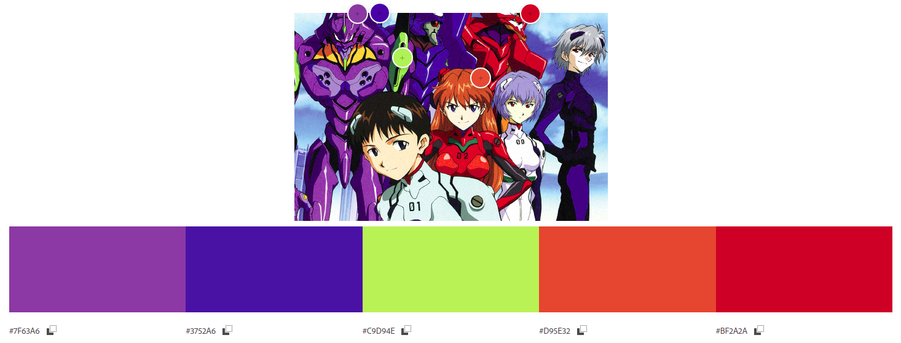

# Introdução

Para esse exercício, eu escolhi uma base de dados sobre animes, e fiz um gráfico relacionado a popularidade de alguns gêneros. A paleta de cores também foi inspirado em um anime, sendo especificada qual foi utilizada mais a frente.

# Importações e configurações iniciais

```{r error=FALSE, warning=FALSE, message=FALSE}
library("tidyverse")

data <- read_csv("animes.csv")
```

# Tratamento dos dados

```{r}
genres <- data %>%
  mutate(genre = str_replace_all(genre, "[\\[\\]']", "")) %>%
  mutate(genre = str_split(genre, ", ")) %>%
  unnest(genre) %>%
  mutate(genre = fct_lump(genre, 4)) %>%
  group_by(genre) %>%
  summarise(n = n()) %>%
  arrange(n)

genres
```

\newpage

# Escolha da imagem e da paleta

Para construir a paleta de cores do gráfico, eu utilizei uma imagem do anime Neon Genesis Evangelion, com o objetivo de trazer mais familiaridade na estética do gráfico.

{width=400px}

A partir disso, eu utilizei o Adobe Color para criar a paleta.



\newpage

# Gráfico final

```{r}
genres %>%
  ggplot(aes(genre, n, fill = genre)) +
  geom_bar(stat = "identity") +
  scale_fill_manual(values = c("#7F63A6", "#3752A6", "#C9D94E", "#D95E32", "#BF2A2A")) +
  labs(x = "Genre", y = "Quantity", title = "Anime genres popularity") +
  guides(fill = FALSE)
```
